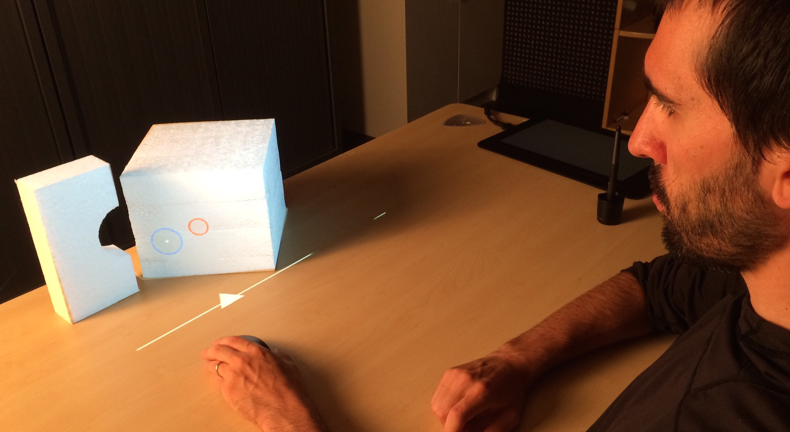
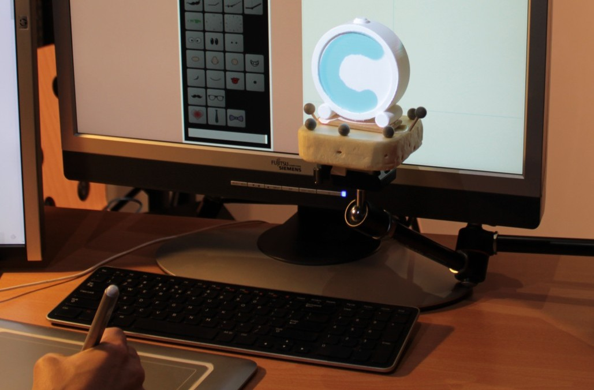

## Abstract
<!-- ### Motivation: Why do we care about the problem and the results? -->
Most of our waking hours are now spent staring at a screen. While the advances in touch screens has enabled the use of more expressiveness by using our fingers to interact with digital content, what we see and manipulate on screen is still an emulation of real-world metaphors. The range of capabilities of the human senses are much richer that what screens can currently offer. In order to be sustainable in the future, interaction with the digital world should leverage these human capabilities instead of letting them atrophy. One way to provide richer interaction modalities is to rely on the physical world itself as an host for digital content. Spatial Augmented Reality (SAR) provides a technical mean towards this idea by using projectors to shed digitally controlled light onto real-world objects to augment them and their environment with functionalities and content. This leads the way to smart objects that will have very rich possibilities while still be anchored in the real-world.

<!-- ### Problem statement: What problem are your trying to solve? -->
However, making the real and digital cohabit on a physical medium makes it difficult to interact with the digital content. Direct touch can be a solution most of the time. However, touch is still plagued by the "fat finger" problem and is not appropriate for complex geometries or when precision is required. This thesis is interested in two main questions: How can we interact with projected content when hosted on tangible objects? and how can augmented physical objects be used to increase our awareness of our own human capabilities and senses, i.e. our own body?

### Interaction with Spatial Augmented Reality
The first part of the thesis is focusing on the interaction with physical objects, augmented using SAR. The work includes an evaluation of a pointing technique (CurSAR) and an interaction metaphor for bridging interaction on traditional computer screens and physical augmented objects.

#### CurSAR
<!-- margin: top right bottom left -->

CurSAR is a project investigating the use of 2D input devices to point at augmented physical objects. The main goal of the study was to compare the performance of a pointing task in a SAR and SCREEN condition. We created an experimental setup that allowed to have the same view of augmented objects either physical (SAR) or virtual (SCREEN).  Participants were 11% slower in the SCREEN condition. However, the transfer function of the mouse to the cursor, even without the physical presence of a screen as a reference system for the cursor, continued to the be effective.

#### Tangible Viewports: Bridging Desktop Computers and Physical Augmented Objects

Tangible Viewports is an interaction metaphor developed to integrate physical objects into a desktop computer environment. It consists of an on-screen window that is aware of physical objects placed in front of it. When the screen cursor is about to be occluded by the object from the point of view of the user, the cursor appears on the surface of the physical object. Most activities involving digital creation are still conveyed on desktop or laptop computers (e.g. design, graphics, programming, etc). Enabling seamless interaction between native computer applications such as Photoshop and programming environments and physical objects makes it possible to envision a way to let users and developers create, tweak and interact with augmented objects with traditional tools.

The proposed system also supports different input modalities depending of its spatial relationship with the screen of the computer. When located in front of the screen, it is possible to use any computer input device (i.e. mouse, graphics tablet) to create graphics, animations and interactive elements on the surface of the object directly. When the object is picked up, it is for example possible to interact with the different elements with direct touch. Considered in a creative workflow, this quick back and forth between the development environment (screen-centric) and the direct manipulation (handheld) could reduce the feedback loop and test ideas and design quicker.

### Physiological Introspection with Physical Augmented Objects

#### Teegi: Tangible EEG Interface

#### TOBE: Tangible Out of Body Experience

<!-- ### Approach: How did you go about solving or making progress on the problem? Did you use simulation, analytic models, prototype construction, or analysis of field data for an actual product? -->
We investigated interacting with SAR using traditional input modalities (mouse and graphic tablets) as a basis. Mice are still relevant today for tasks that involve precision and prolonged use. Moreover, they are the default input device with traditional laptops and desktop computers which are the de facto platforms used for creating digital content. We evaluated the performance of using indirect 2D input devices to point at augmented objects without the use of a screen. We found that the performance of using a mouse without the presence of a physical screen reduced the performance (11%) but did not break the interaction metaphor. We also designed an interaction metaphor, Tangible Viewports, an on-screen window enabling physical objects to be used in the context of a desktop computer screen and its native application such as Photoshop. Initial feedback have shown that the metaphor was transparent for the users.

Additionally, we investigated the use of augmented objects for scientific mediation concerning the body. We combined SAR, TUI and physiological computing to create two main systems: Teegi and TOBE. Teegi (Tangible EEG Interface) is a physical puppet that allows novice users to visualize and interact with their live Entrocenphalography (EEG) readings to explore different brain processes. TOBE (Tangible Out of Body Experience) is a platform that enables users to augment and explore in real-time a physical avatar with customized representations that are animated with their physiological readings (ECG, breathing sensor, GSR and EEG).

### Results: What's the answer?

### Conclusions: What are the implications of your answer? Is it going to change the world (unlikely), be a significant "win", be a nice hack, or simply serve as a road sign indicating that this path is a waste of time (of of the previous results are useful)?
